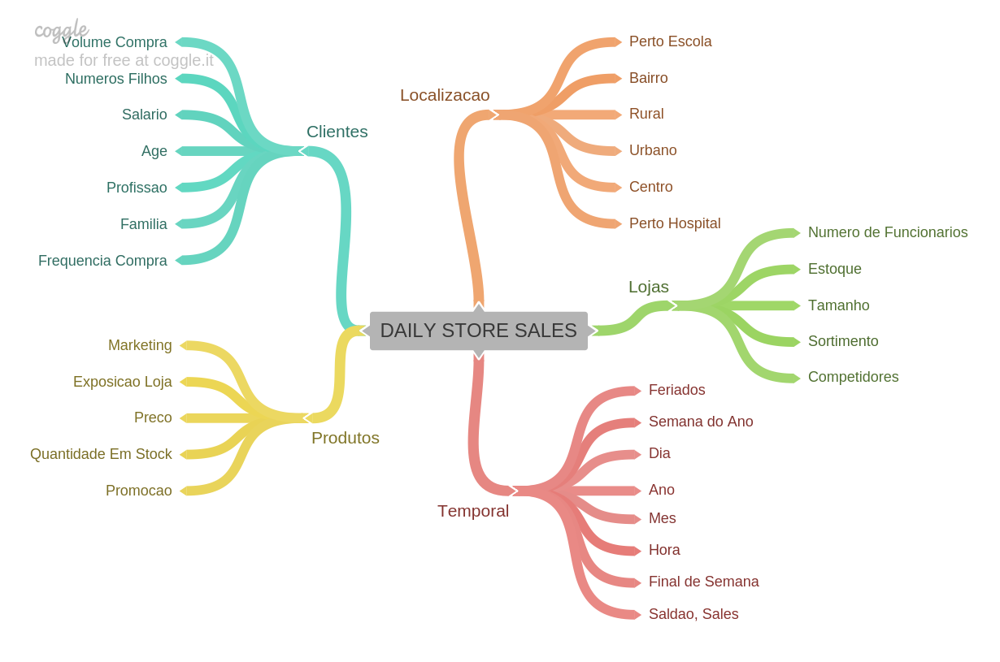

# 🏪 Rossmann Store Sales — Previsão de Vendas com Deploy em Produção

> Um projeto de **Data Science de ponta a ponta** (CRISP-DM): prever as vendas das próximas **6 semanas** para **1.115 lojas** da rede de farmácias Rossmann e **colocar o modelo em produção** — acessível por uma **API**, um **bot de Telegram** e um **webapp**.

<p align="left">
  
  
  
  
  
  
  
  
</p>

---

## 👤 Autor

**Gustavo Caldeira** — Analista de Dados

[](https://www.linkedin.com/in/gustavocaldeirads)
[](mailto:gustavocaldeirads@gmail.com)

---

## 📌 Contexto do problema de negócio

A **Rossmann** é uma das maiores redes de farmácias da Europa, com mais de 3 mil lojas. O **CFO** solicitou uma previsão de vendas das próximas **6 semanas** de cada loja para decidir **quanto investir na reforma** de cada unidade — uma decisão orçamentária que depende diretamente da expectativa de faturamento.

Hoje, essa previsão era feita de forma manual e heterogênea por cada gerente, gerando estimativas inconsistentes. A solução proposta: um **modelo de machine learning** que prevê as vendas por loja de forma padronizada e **disponível sob demanda** — o gerente consulta a previsão de qualquer loja direto pelo **Telegram**.

**Pergunta de negócio:** *Quanto cada loja vai vender nas próximas 6 semanas?*

---

## 🗺️ Solução (método CRISP-DM)

O projeto foi desenvolvido em **ciclos do CRISP-DM** (cada notebook `m02`…`m10` é uma iteração que refina a solução de ponta a ponta), seguindo as etapas:

| Ciclo | Etapa | O que foi feito |
|:-----:|-------|------------------|
| m02 | **Descrição dos dados** | Dimensões, tipos, tratamento de nulos (ex.: imputação de `competition_distance`). |
| m03 | **Feature engineering** | Derivação de atributos temporais e de competição a partir de um **mapa mental de hipóteses**. |
| m04 | **EDA** | Análise univariada, bivariada (validação de hipóteses) e multivariada. |
| m05 | **Preparação dos dados** | Rescaling, *encoding* e transformação de natureza cíclica (mês, dia, semana). |
| m06 | **Seleção de atributos** | **Boruta** (algoritmo de seleção baseado em Random Forest). |
| m07-m08 | **Modelagem & ML** | Treino e **validação cruzada** de múltiplos algoritmos. |
| m09 | **Fine-tuning** | Otimização de hiperparâmetros do modelo escolhido. |
| m10 | **Tradução para negócio** | Interpretação do erro em R$ e cenários (melhor/pior caso). |
| — | **Deploy** | Modelo em produção via API Flask + bot de Telegram + webapp. |



---

## 🤖 Desempenho dos modelos

Comparação por **validação cruzada** (a métrica honesta, que evita superestimar o desempenho):

| Modelo | MAE (CV) | MAPE (CV) | RMSE (CV) |
|--------|---------:|----------:|----------:|
| **Random Forest** | 837,7 ± 219 | **0,12** | 1.256 ± 320 |
| **XGBoost** | 1.030,3 ± 167 | 0,14 | 1.478 ± 230 |
| Regressão Linear | 2.081,7 ± 296 | 0,30 | 2.952 ± 468 |
| Lasso | 2.116,4 ± 342 | 0,29 | 3.058 ± 504 |
| *Average (baseline)* | 1.354,8 | 0,46 | 1.835 |

> **Por que XGBoost em produção?** Embora o Random Forest tenha erro ligeiramente menor, o **XGBoost** foi escolhido por ser **muito mais leve e rápido** para servir em produção (menor footprint de memória/armazenamento) — um *trade-off* clássico entre acurácia marginal e custo operacional.

Após o **fine-tuning de hiperparâmetros**, o modelo final atingiu:

| Métrica | Valor |
|---------|------:|
| **MAE** | **664,97** |
| **MAPE** | **9,75%** |
| **RMSE** | 957,77 |

Um **MAPE de ~9,7%** significa que, em média, a previsão erra menos de 10% das vendas reais de uma loja — desempenho sólido para planejamento orçamentário.

---

## 💰 Resultado de negócio

O modelo foi traduzido em **valor financeiro**, com cenários baseados no erro (MAE) do modelo:

| Cenário | Vendas previstas (6 semanas) |
|---------|-----------------------------:|
| **Previsão** | **R$ 285.860.497,77** |
| Pior caso | R$ 285.115.015,71 |
| Melhor caso | R$ 286.605.979,84 |

Cada loja recebe sua própria previsão **com intervalo de cenários** — permitindo ao CFO planejar o orçamento de reformas com a incerteza explícita.

---

## 🚀 Produto de dados (deploy)

O grande diferencial deste projeto é estar **em produção**, não apenas em um notebook:

```
┌────────────────┐     requisição      ┌────────────────────┐
│  Bot Telegram  │ ──────────────────► │   API Flask        │
│  (gerente)     │     store_id        │  (Rossmann class)  │
│                │ ◄────────────────── │  + modelo XGBoost  │
└────────────────┘   previsão (R$)     └────────────────────┘
```

- **`api/`** — API Flask que recebe os dados de uma loja, aplica todo o *pipeline* de preparação (classe `Rossmann`) e retorna a previsão.
- **`rossmann-telegram-api/`** — bot de Telegram: o usuário envia o **ID da loja** e recebe a previsão de vendas das próximas 6 semanas.
- **`webapp/`** — aplicação web para deploy (Heroku, via `Procfile`).

> 💬 **Como usar o bot:** envie o número da loja (ex.: `22`) e o bot responde com o faturamento previsto para as próximas 6 semanas.

---

## 📂 Estrutura do repositório

```
rossmann/
├── notebooks/                  # ciclos CRISP-DM (m02 … m10) + PDFs
│   └── m10_v01_store_sales_prediction.ipynb
├── storytelling/               # apresentação de negócio dos resultados
├── api/
│   ├── handler.py              # endpoint Flask de predição
│   └── rossmann/Rossmann.py    # classe com o pipeline de transformação
├── rossmann-telegram-api/
│   └── rossmann-bot.py         # bot de Telegram
├── webapp/                     # app web para deploy (Heroku)
├── img/MindMapHypothesis.png   # mapa mental de hipóteses
├── requirements.txt
└── README.md
```

---

## 🧠 Principais aprendizados técnicos

- **CRISP-DM iterativo**: cada ciclo entrega uma solução completa e a refina — entrega de valor desde a primeira iteração.
- **Seleção de atributos com Boruta** em vez de escolha manual.
- **Validação cruzada** respeitando a ordem temporal (séries de vendas).
- **Tradução do erro estatístico em R$** e cenários — comunicação com a área de negócio.
- **MLOps**: empacotamento do pipeline em uma classe reutilizável e deploy como produto de dados (API + bot).

---

## 🛠️ Tecnologias

`Python` · `Pandas` · `NumPy` · `scikit-learn` · `XGBoost` · `Boruta` · `Flask` · `Telegram Bot API` · `Heroku`

---

## ▶️ Executar localmente (API)

```bash
git clone https://github.com/gustavocaldeirasantos/rossmann.git
cd rossmann
pip install -r requirements.txt
python api/handler.py        # sobe a API Flask localmente
```

> ⚠️ Os notebooks e a API referenciam caminhos de modelo (`model_rossmann.pkl`) e arquivos de `parameter/` do treino. Para reproduzir o deploy completo, gere esses artefatos executando o ciclo final (`notebooks/m10_...ipynb`).

---

## 📜 Licença

Distribuído sob a licença **MIT**.

---

<sub>📊 Projeto de portfólio — Data Science em produção. Problema clássico de previsão de vendas da rede Rossmann, resolvido com a metodologia CRISP-DM e disponibilizado como produto de dados.</sub>
